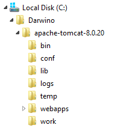
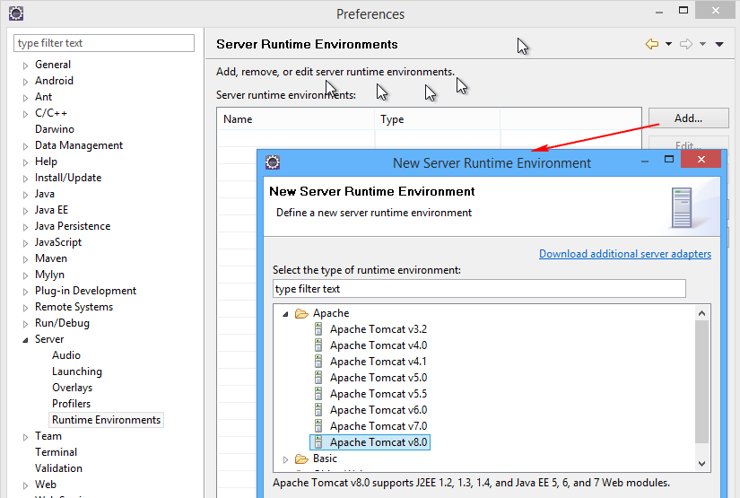
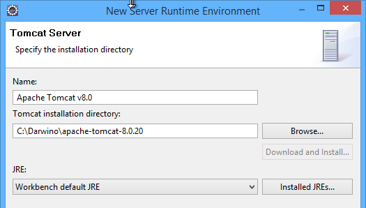
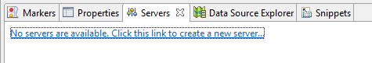
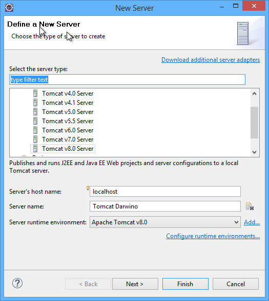
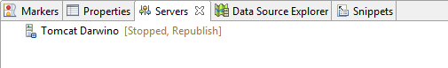

If you plan to use TOMCAT as the development web application server, then you have to both install it in the file system and eventually configure Eclipse to use it.

Installing Apache TOMCAT
------------------------
Download the latest TOMCAT server (8.x) from the Apache Web Site: [https://tomcat.apache.org/download-80.cgi](https://tomcat.apache.org/download-80.cgi "Download Tomcat").
Just unzip the server under your installation directory:

If you plan to use the demo applications, then you need to add some demo users with roles in your tomcat environment. Add the following content to `{tomcat install dir}\conf\tomcat-users.xml` :

    <!-- TOMCAT manager -->
      <role rolename="admin-gui"/>
      <role rolename="manager-gui"/>
    
      <role rolename="admin"/>
      <role rolename="manager"/>
      <role rolename="user"/>
      <role rolename="peuser"/>
      
      <user password="passw0rd" roles="manager,admin,user,admin-gui,manager-gui" username="admin"/>
      <user password="passw0rd" roles="user,admin-gui,manager-gui" username="phil"/>
      <user password="passw0rd" roles="user" username="phil2"/>
      <user password="passw0rd" roles="user" username="phil3"/>
      <user password="passw0rd" roles="user" username="phil4"/>
      <user password="passw0rd" roles="user" username="phil5"/>
      
      <user password="floflo" roles="peuser,user,admin" username="amass"/>
      <user password="floflo" roles="peuser" username="pcollins"/>
      <user password="floflo" roles="peuser" username="acalder"/>  
    

Configuring Eclipse with TOMCAT
------------------------------
Eclipse J2EE comes with a set of tools called WTP, which allows the configuration and use of application servers.
To configure Apache TOMCAT, you have to create a new 'Runtime Environment' from the Eclipse 'Window->Preferences...':

Once the runtime environment is configured, you should create a new server. For this, you should either make visible the Eclipse 'Servers' view (Window->Show View...Servers) or switch to the J2EE perspective (Window->Open Perspective...Java EE).
In the server view, create a new server by hitting the link bellow. If the view displays a list instead, right click and select 'New->Server...'

Select your TOMCAT environment and eventually change the server name, and hit 'Finish'

Now you have your server ready for the Darwino applications

