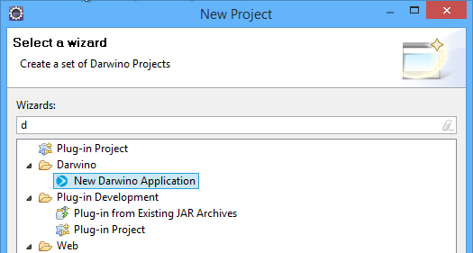
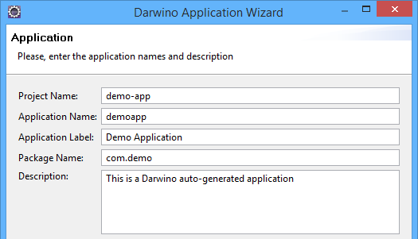
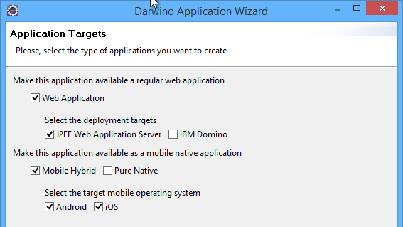

Although Darwino does not require the use of any IDE to work, the Darwino studio is the fastest way to get started with a new project.

Using the Darwino Application Wizard
------------------------------------

From the Eclipse main menu. select File...New...Project... and the search for Darwino:

Select 'New Darwino Application' hit Next.

For your first project, you can live the default values as is

This will create a Darwino Application that can run on a J2EE server, an Android mobile device and an iOS mobile device. To support all these platforms while sharing code, the wizard generated several projects in the Eclipse workspace: