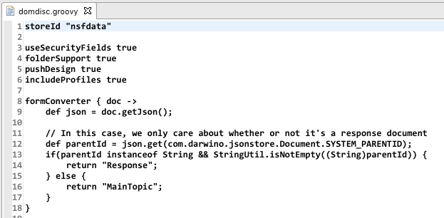
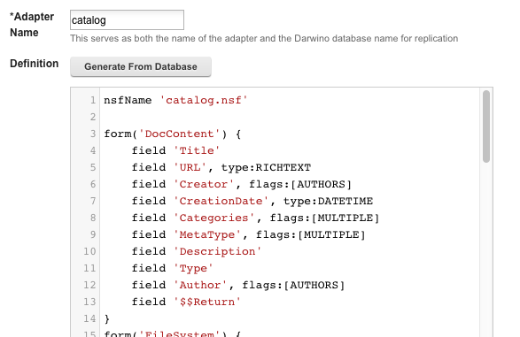

# Customizing the data transformation

The database adapters are written in Groovy, using a DSL (Domain Specific Language). It is essentially a set of hooks that are provided to the Groovy environment and that are executed to build the adapter. This allows the adapters to defined in a natural and flexible way.

There are several benefits to using Groovy for the adapter definitions:

- Groovy is a straightforward scripting language that runs on top of the Java virtual machine. It was designed from the start to be a friendlier way to write Java, and it lends itself to writing Domain Specific Languages. In this case, everything about the adapter scripting language is focused on the writing of database adapters.
- Groovy’s closures, with their names parameters, are ideal for creating easy-to-read, concise, and extensible data definitions.

```
def commonDoc = {
  field "from", type:NAMES
  field "text", flags:MULTIPLE
  field "body", type:RICHTEXT
}
form("Topic", commonDoc)
```


There are two ways to deploy the adapters:

* Install them as you would install any other plugin on Domino



- Define them in the Synchronization database by creating an Adapter Definition document

