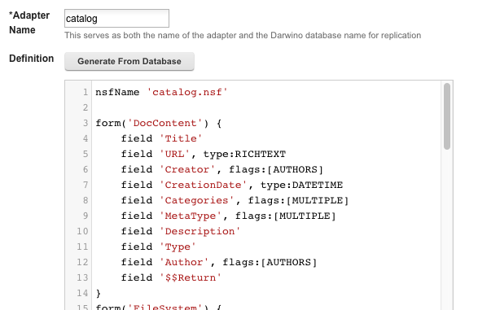

# Introduction to the Groovy DSL

The DSL used to define Domino data transformation is designed to be straightforward for normal cases but to have enough hooks to cover much more complicated situations.

When using the Darwino Sync Admin application, the "Generate From Database" button allows you to choose a database from a server and generate a default script based on the database's forms. For example, here is the result of choosing the local server's Catalog database:

This generated code shows off the primary elements of the DSL:

- `nsfName` is the top-level command that tells the adapter which NSF this connects to. This field uses Notes's "network path" format, and can include a remote server name separated by `!!`, such as `"RemoteServer/Org!!catalog.nsf"`
- The `form` command specifies a form name and opens a per-document converter block
- The `field` command specifies how to handle a given item name when found in a document. The names themselves are case-insensitive in Domino documents, while the keys in the Darwino JSON are always lowercased for consistency
	- The `type` attribute for fields specifies the data type to convert to; when left out, it defaults to text. The available types are:
		* `TEXT` for normal text and text-list values
		* `NUMBER` for numeric values (always treated as floating point on both Domino and Darwino)
		* `DATETIME` for date and time values, including date-only and time-only
		* `RICHTEXT` for rich text or MIME data (always converted to MIME when transforming to JSON)
		* `BOOLEAN` for values that should be converted to `true`/`false` in Darwino. The way this translates to Domino will covered later
		* `USERDATA` for binary data stored as "user data" in Domino, which can be used in advanced cases
		* `JSON` for values stored as JSON-compatible strings in Domino, which is converted to its native representation in Darwino
	- The `flags` attribute for fields specifies additional information about how to handle conversion. The available flags are:
		* `MULTIPLE` for fields that are expected to contain multiple values. For consistency, these values are always stored as arrays in JSON, even if there is only one entry
		* `NAMES` for Domino names fields that are neither reader nor author fields. These values are converted to and from LDAP format in JSON
		* `READERS` for readers fields, which are also converted to and from LDAP format and are stored in the special `_readers` field structure in JSON
		* `AUTHORS` for authors fields, which are also converted to and from LDAP format and are stored in the special `_writers` field structure in JSON
		* `NONSUMMARY` to denote fields that should have their summary flag un-set in Domino, to allow for storing larger data
		* `TAGS` to denote a single field per document that will be stored in the `_tags` field in JSON, which is treated specially in Darwino
		* `DISABLED` to mark a field as ignored on a per-field basis