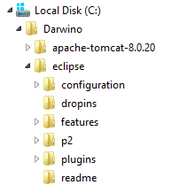
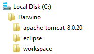

Installing and setting up Eclipse for Darwino
=============================================

Installing the Eclipse IDE
-----------------------------
Although the use of an IDE, and in particular Eclipse, is not a requirement, it certainly eases the development of Darwino applications.

In order to configure web servers and get the best web development experience, please download and install the latest version of '**Eclipse IDE for Java EE Developers**'.
[http://www.eclipse.org/downloads/](http://www.eclipse.org/downloads/ "Eclipse Download")

Installing Eclipse is achieved by unzipping the archive in its target directory:

Launching Eclipse for the first time
------------------------------------

When Eclipse is launched for the first time, it prompts for a workspace directory. If the default value should work well, you can also make this directory a peer of the eclipse one, to get the whole environment contained within `c:\Darwino`:

Configuring Eclipse
-------------------

Darwino requires some extra plug-ins bellow to be installed on top of the version of Eclipse. These plug-ins can generally be installed from the Eclipse Marketplace or by selecting `Help->Install New Software...`, then use the provided update site URL

- For developing Web (J2EE) applications
	- M2E WTP
**Note**: your version of Eclipse, if it is recent enough, might already have this feature installed. In this case, just skip this step.
Select `Help->Eclipse Marketplace...` and search for `m2e wtp`. Be careful to install m2e-wtp matching your Eclipse version and *not* m2eclipse-wtp, which is deprecated.
- If Android is a desired target platform
	- Android development toolkit (aka ADT), 
Follow the instructions under "*Download the ADT Plugin*" from [http://developer.android.com/sdk/installing/installing-adt.html](http://developer.android.com/sdk/installing/installing-adt.html)
Update site URL, [https://dl-ssl.google.com/android/eclipse/](https://dl-ssl.google.com/android/eclipse/ "Update Site")
	- Android for Maven Eclipse ([http://rgladwell.github.io/m2e-android/](http://rgladwell.github.io/m2e-android/))
Select `Help->Eclipse Marketplace...` and search for `android m2e`.
- If iOS is a desired target platform
	- RoboVM
Follow the instructions under "*RoboVM for Eclipse*" from [http://robovm.com/develop/documentation/](http://robovm.com/develop/documentation/)
	- Update site URL, [http://download.robovm.org/eclipse/](http://download.robovm.org/eclipse/ "Update Site")
- In case you want to use WRO4J to optimize your JavaScript/CSS code, it is advised to install the m2e-wro4j connector
	- WRO4J Connector, 
Follow these instructions: [https://github.com/jbosstools/m2e-wro4j](https://github.com/jbosstools/m2e-wro4j "M2E-WRO4J")
	- Update site URL, [http://download.jboss.org/jbosstools/updates/m2e-wro4j/](http://download.jboss.org/jbosstools/updates/m2e-wro4j/ "Update Site")

Installing the Darwino Studio add-on
------------------------------------
The Darwino studio provides a set of tools and wizards. It is available from an Eclipse update site located at: [http://builds.darwino.com/studio/nightly](http://builds.darwino.com/studio/nightly "Darwino Update Site"). *("nightly" is temporary and subject to change soon)*

Bellow are the instructions:
1. Select Help > Install New Software.
1. In the "Wok With:" field, enter the following URL:
	[http://builds.darwino.com/studio/nightly](http://builds.darwino.com/studio/nightly "Darwino Update Site")
1. When prompted, enter your Darwino user and password.
1. In the Available Software dialog, select the Darwino Studio checkbox.
1. In the next window, you'll see a list of the tools to be downloaded. Click Next.
1. Read and accept the license agreements, then click Finish.
1. If you get a security warning saying that the authenticity or validity of the software can't be established, click OK.
1. When the installation completes, restart Eclipse.
