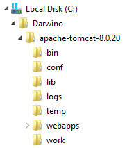
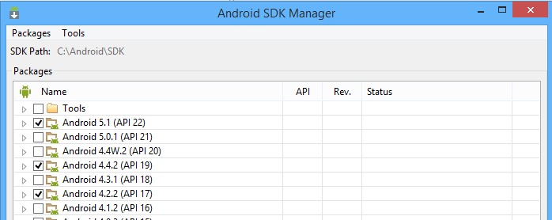

Darwino Demo Environment Setup
==============================

Darwino is a very flexible platform that supports IDE or command line based development. The platform itself is built using [Apache Maven](http://maven.apache.org/ "Apache Maven"). If Maven is also the recommended build tool for Darwino applications, other systems can also be used, including Gradle, Eclipse PDE...

Darwino currently supports the following target platforms:
- Web applications through a Java EE server
- Android applications
- Apple iOS applications

Notes: Based on Apple requirements, an Apple Mac running OSX is required for developing Apple iOS applications. Currently, only Android applications can be developed and tested using Microsoft Windows or Linux.

Unless specified otherwise, all the installation instructions assume a Microsoft Windows environment, with the software being installed on `c:\Darwino`.

Darwino prerequites
-------------------

A Java environment must be installed on your machine. The minimum version is Java 7, but it is advised to use the latest one (Java 8 as of today).

A web application server is required to run the web applications. Although any servlet container 2.5+ would work, these instructions show how to install/run the demo projects using Apache TOMCAT

A Postgres 9.4 database server. Other databases are usable, but the demo applications are pre-configured to work with PostgreSQL.

Installing the Java JRE/JDK
---------------------------

If you plan to use Eclipse as the main development environment, then a Java JRE is sufficient. If you plan to use Maven from the command line, then you'll need a full JDK to be installed.

The Java JRE and SDK can be downloaded from the Oracle web site: [http://www.oracle.com/technetwork/java/javase/downloads/index.html](http://www.oracle.com/technetwork/java/javase/downloads/index.html)
Once installed, make sure that the development environment variable JAVA_HOME is pointing to you Java environment. Make also sure that you JVM is available from the command line by emitting `java -version`.

Installing Apache TOMCAT
------------------------

Download the latest TOMCAT server (8.x) from the Apache Web Site: [https://tomcat.apache.org/download-80.cgi](https://tomcat.apache.org/download-80.cgi "Download Tomcat").
Just unzip the server under your installation directory:

Installing the Android application development tools
----------------------------------------------------

Developing for the Android platform requires the Android Software Development Kit to be installed. It is available from: [http://developer.android.com/sdk/index.html#Other](http://developer.android.com/sdk/index.html#Other "Android SDK"). The 'SDK Tools only' package is sufficient if you plan to use Eclipse or Maven from the command line.

Using the SDK manager [Android SDK manager](http://developer.android.com/tools/help/sdk-manager.html), select and install at least the entire "Android 4.2.2 (API 17)" & "Android 4.4.2 (API 19)" folders.

Additionally, set the path to the Android SDK root (e.g. `c:\Android\SDK`) in an environment variable named `ANDROID_HOME` as well as in the Maven `settings.xml` (see the documentation on installing Maven).

Note: using the stock Android emulator, it is likely that the applications will be too slow to provide a great developer experience. This is particularly true if you launch the emulator from a virtual machine. It is then better to run the demo applications on real hardware or in a faster emulator/virtual machine. See: [http://blog.riand.com/2014/08/running-android-apps-for-development.html](http://blog.riand.com/2014/08/running-android-apps-for-development.html)

Installing the iOS application development tools
------------------------------------------------

As stated earlier, developing for iOS requires an Apple Mac computer running OSX. To compile, run in a simulator or deploy the application, the the Apple Xcode development environment is required. It is available freely from the Mac App Store ([https://itunes.apple.com/us/app/xcode/id497799835?mt=12](https://itunes.apple.com/us/app/xcode/id497799835?mt=12 "Xcode")).

PostgreSQL
----------

By default, the demo projects look for a [PostgreSQL](http://www.postgresql.org) database on the local host using:
Port: 5434- 
- Database: dwodemo
- Username: postgres
- Password: postgres

----------
-------------

Maven Configuration
-------------------

The Maven settings differ based on whether you're using a [local repository](Maven Settings - Local Repo) or a [remote repository](Maven Settings - Remote Repo).

iOS
---

To build the iOS applications, you will need a Mac with Xcode installed. To run them inside Eclipse, you will also need the [RoboVM for Eclipse plugin](http://marketplace.eclipse.org/content/robovm-eclipse).

Android
-------

The Android projects use the ADT plugins for Eclipse, available from http://developer.android.com/sdk/installing/installing-adt.html . Using the SDK manager (Window -> Android SDK Manager), select and install at least the entire "Android 4.2.2 (API 17)" folder.

Additionally, set the path to the Android SDK root (e.g. c:\android-sdks) in an environment variable named ANDROID_HOME as well as in the Maven settings.xml above.

Note: using the stock Android emulator, it is likely that the internal web server for the Hybrid application will be too slow to launch for the app to work correctly, leading to a connection-failure dialog. It is better to run this application on real hardware or in a faster emulator/virtual machine.

Eclipse Import
--------------

Using "Import &rarr; Maven &rarr; Existing Maven Projects", import the projects from the darwino-demo folder.

In a new Eclipse installation, Eclipse will generate some errors about "Plugin execution not covered by lifecycle configuration" referring to several of the pom files. To fix this, choose the Quick Fix for the error that discovers new m2e connectors. After going through this process and installing the connectors, Eclipse will stop complaining.

J2EE Projects
-------------

The "dwo-demo-news-j2ee" and "dwo-jre-j2ee-devtools" apps are written to be run on [Tomcat](http://tomcat.apache.org), though would likely be fine on other servers as well.

The demo projects use a static list of users, defined in the dwo-demo-commons-triloggroup project, in the `com.triloggroup.demo.users.StaticTomcatUserService` class. To work with this default user pool, add at least the following users to the Tomcat server's tomcat-users.xml file:

	<role name="user"/>
	<user password="floflo" roles="user" username="atinov"/>
	<user password="floflo" roles="user" username="amass"/>
	<user password="floflo" roles="user" username="aboucher"/>
	<user password="floflo" roles="user" username="acalder"/>
	<user password="floflo" roles="user" username="agardner"/>
	<user password="floflo" roles="user" username="bchapot"/>
	<user password="floflo" roles="user" username="blemercier"/>
	<user password="floflo" roles="user" username="bchris"/>
	<user password="floflo" roles="user" username="bbright"/>
	<user password="floflo" roles="user" username="larmatti"/>
	<user password="floflo" roles="user" username="lbros"/>
	<user password="floflo" roles="user" username="mdavis"/>
	<user password="floflo" roles="user" username="pcollins"/>
	<user password="floflo" roles="user" username="rjordan"/>

These parameters are defined in the dwo-demo-commons-triloggroup project, in the `com.triloggroup.demo.users.DemoSqlContext` class.