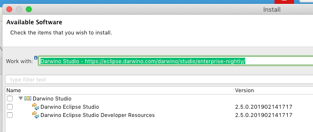

# Implementing a UI Generator

### Install the Studio Developer Resources

Install Darwino Studio and the "Darwino Eclipse Studio Developer Resources" feature, which includes source for the Studio plugins:



### Create a Plug-in Project

The plug-in project should use the normal Eclipse PDE plug-in mechanism, and it's best to create it as a Maven project with Tycho. [The tutorial at Vogella](https://www.vogella.com/tutorials/EclipseTycho/article.html) provides a good example of setting up a plug-in project as well as its associated feature and update site projects.

### Add the Studio Repository to the Maven Pom

Assuming you're using Maven to build the plugins, add either the Darwino Studio update site (if using Tycho, as in the above tutorial) or individual Maven dependencies to the pom. For the former:

```xml
<repositories>
	<repository>
		<id>Photon</id>
		<layout>p2</layout>
		<url>http://download.eclipse.org/releases/photon/</url>
	</repository>
	<repository>
		<id>DarwinoStudio</id>
		<layout>p2</layout>
		<url>https://eclipse.darwino.com/darwino/studio/enterprise-nightly/</url>
	</repository>
</repositories>
```

For the latter:

```xml
<dependency>
	<groupId>com.darwino</groupId>
	<artifactId>dwo-studio-shared</artifactId>
	<version>${DARWINO_VERSION}</version>
</dependency>
```

### Configure the Plug-in's MANIFEST.MF

In the plugin's MANIFEST.MF, add at lease "com.darwino.commons", "com.darwino.commons.vfs", "com.darwino.commons.script", "com.darwino.design", and "dwo-studio-shared" as Required Plug-ins. Additionally, mark the plug-in as a singleton. The final MANIFEST.MF source should look something like:

```
Manifest-Version: 1.0
Bundle-ManifestVersion: 2
Bundle-Name: Example
Bundle-SymbolicName: com.darwino.studio.plugin.example;singleton:=true
Bundle-Version: 1.0.0.qualifier
Bundle-Vendor: DARWINO
Automatic-Module-Name: com.darwino.studio.plugin.example
Bundle-RequiredExecutionEnvironment: JavaSE-1.8
Require-Bundle: com.darwino.commons;bundle-version="2.5.0",
 com.darwino.commons.vfs;bundle-version="2.5.0",
 com.darwino.commons.script;bundle-version="2.5.0",
 com.darwino.design;bundle-version="2.5.0",
 dwo-studio-shared;bundle-version="2.5.0"
```

### Create a Darwino Plug-in Class

Create a new class that extends `com.darwino.studio.plugin.example`. For example:

```java
package com.darwino.studio.plugin.example;

import com.darwino.commons.platform.impl.PluginImpl;

public class ExamplePlugin extends PluginImpl {
	public ExamplePlugin() {
		super("Example Plugin"); //$NON-NLS-1$
	}
}
```

To register this plugin, create a new file in the root of your project named "plugin.xml" and declare a contribution to the `darwino.eclipse.darwinoPlugin` extension point and reference your class:

```xml
<?xml version="1.0" encoding="UTF-8"?>
<?eclipse version="3.4"?>
<plugin>
	<extension point="darwino.eclipse.darwinoPlugin">
		<service class="com.darwino.studio.plugin.example.ExamplePlugin" />
	</extension>
</plugin>
```

Add "plugin.xml" to the `bin.includes` property in the "build.properties" file:

```properties
source.. = src/
output.. = bin/
bin.includes = META-INF/,\
               .,\
               plugin.xml
```

### Create a Generator Class

Create a new class that extends `com.darwino.studio.designer.GeneratorExtension` with some scaffolding methods:

```java
public class ExampleGeneratorExtension extends GeneratorExtension {
	public static final String GENERATOR_ID = "example"; //$NON-NLS-1$
	
	public static final String THEME_STANDARD 	= "standard"; //$NON-NLS-1$
	
	public ExampleGeneratorExtension() {
	}
	
	@Override
	public void createGenerators(List<GeneratorFactory.GeneratorDefinition> generators) {
		generators.add(new GeneratorDefinition(GENERATOR_ID, "Example Generator"));
	}
	
	@Override
	public void createThemes(String generator, List<GeneratorFactory.ThemeDefinition> themes) {
		if(generator.equals(GENERATOR_ID)) {
			themes.add(new ThemeDefinition(THEME_STANDARD, "Example Generator Standard"));
		}
	}
	
	@Override
	public AppBuilder createBuilder(VFS sourceVfs, VFS targetVfs, ProblemReporter problemReporter, GeneratorEntry entry) {
		if(StringUtil.equals(entry.getGenerator(),GENERATOR_ID)) {
			// TODO return builder
		}
		return null;
	}
}
```

Back in the Darwino plug-in class, add this as a contribution:

```java
package com.darwino.studio.plugin.example;

import java.util.List;

import com.darwino.commons.platform.impl.PluginImpl;
import com.darwino.studio.designer.GeneratorExtension;

public class ExamplePlugin extends PluginImpl {
	public ExamplePlugin() {
		super("Example Plugin"); //$NON-NLS-1$
	}
	
	@Override
	public void findExtensions(Class<?> serviceClass, List<Object> extensions) {
		if(serviceClass == GeneratorExtension.class) {
			extensions.add(new ExampleGeneratorExtension());
		}
	}
}
```

### Create the AppBuilder Class

Create a new class that extends `com.darwino.studio.designer.generators.web.WebAppBuilder` (for a wholly-new generator) or an existing generator. For this example, we'll extend the React Bootstrap generator with hooks to provide form and view generators:

```java
package com.darwino.studio.plugin.example;

import com.darwino.commons.vfs.VFS;
import com.darwino.commons.vfs.VFSException;
import com.darwino.studio.designer.definition.DWForm;
import com.darwino.studio.designer.definition.DWView;
import com.darwino.studio.designer.generators.GeneratorException;
import com.darwino.studio.designer.generators.web.reactjs.ReactFormGenerator;
import com.darwino.studio.designer.generators.web.reactjs.ReactViewGenerator;
import com.darwino.studio.designer.generators.web.reactjs.bootstrap.BsAppBuilder;
import com.darwino.studio.designer.project.AppGeneratorOptions.GeneratorEntry;
import com.darwino.studio.util.ProblemReporter;

public class ExampleAppBuilder extends BsAppBuilder {

	public ExampleAppBuilder(VFS sourceVfs, VFS targetVfs, ProblemReporter problemReporter, GeneratorEntry generatorEntry) {
		super(sourceVfs, targetVfs, problemReporter, generatorEntry);
	}

	@Override
	protected ReactFormGenerator createFormGenerator(DWForm form) throws GeneratorException, VFSException {
		return super.createFormGenerator(form);
	}
	@Override
	protected ReactViewGenerator createViewGenerator(DWView view) throws GeneratorException, VFSException {
		return super.createViewGenerator(view);
	}
}
```

Add this app builder to the `GeneratorExtension` class in the `createBuilder` method:

```java
	@Override
	public AppBuilder createBuilder(VFS sourceVfs, VFS targetVfs, ProblemReporter problemReporter, GeneratorEntry entry) {
		if(StringUtil.equals(entry.getGenerator(),GENERATOR_ID)) {
			return new ExampleAppBuilder(sourceVfs, targetVfs, problemReporter, entry);
		}
		return null;
	}
```

### Implement a Form Generator

Following with the example of extending the React Bootstrap generator, create a new class that extends `com.darwino.studio.designer.generators.web.reactjs.bootstrap.BsFormGenerator`. This example shows overriding each individual-field method with the same implementation as the parent, to show how they call the centralized `field` method:

```java
package com.darwino.studio.plugin.example;

import java.io.IOException;
import java.util.List;

import com.darwino.commons.json.JsonException;
import com.darwino.design.DesignFormComponent;
import com.darwino.design.DesignFormComponentValue;
import com.darwino.studio.designer.definition.DWForm;
import com.darwino.studio.designer.generators.web.reactjs.bootstrap.BsFormGenerator;

public class ExampleFormGenerator extends BsFormGenerator {

	public ExampleFormGenerator(DWForm form) {
		super(form);
	}
	
	@Override
	protected StringBuilder textField(DesignFormComponent component) throws JsonException, IOException {
		return field(component, "text", "renderText", null, false, null, null); //$NON-NLS-1$ //$NON-NLS-2$
	}

	@Override
	protected StringBuilder richTextField(DesignFormComponent component) throws JsonException, IOException {
		return field(component, null, "renderRichText", null, false, null, null); //$NON-NLS-1$
	}

	@Override
	protected StringBuilder textAreaField(DesignFormComponent component) throws JsonException, IOException {
		return field(component, null, "renderTextArea", null, false, null, null); //$NON-NLS-1$
	}

	@Override
	protected StringBuilder datePickerField(DesignFormComponent component) throws JsonException, IOException {
		return field(component, null, "renderDatePicker", null, false, null, null); //$NON-NLS-1$
	}

	@Override
	protected StringBuilder selectField(DesignFormComponent component) throws JsonException, IOException {
		return field(component, null, "renderSelect", component.getValues(), true, null, null); //$NON-NLS-1$
	}

	@Override
	protected StringBuilder radioField(DesignFormComponent component) throws JsonException, IOException {
		return field(component, null, "renderRadioGroup", component.getValues(), false, null, null); //$NON-NLS-1$
	}

	@Override
	protected StringBuilder checkBoxField(DesignFormComponent component) throws JsonException, IOException {
		return field(component, null, "renderCheckbox", null, false, component.getSelectedValue(), component.getNotSelectedValue()); //$NON-NLS-1$
	}

	@Override
	protected StringBuilder field(DesignFormComponent component, String type, String componentType,
			List<DesignFormComponentValue> options, boolean optionPlaceholder, String checkedValue,
			String uncheckedValue) throws JsonException, IOException {
		return super.field(component, type, componentType, options, optionPlaceholder, checkedValue, uncheckedValue);
	}
}
```

Add this form generator to the `AppBuilder` class's `createFormGenerator` method:

```java
	@Override
	protected ReactFormGenerator createFormGenerator(DWForm form) throws GeneratorException, VFSException {
		return new ExampleFormGenerator(form);
	}
```

