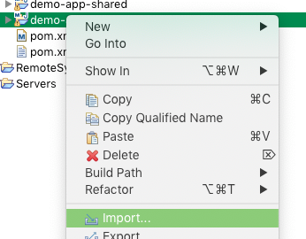
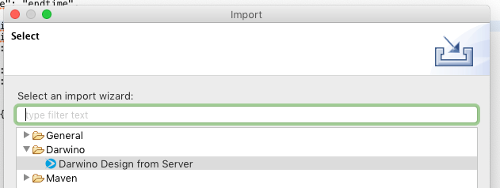
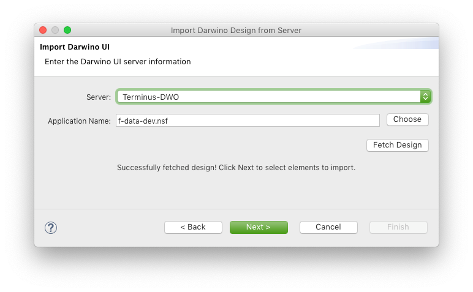
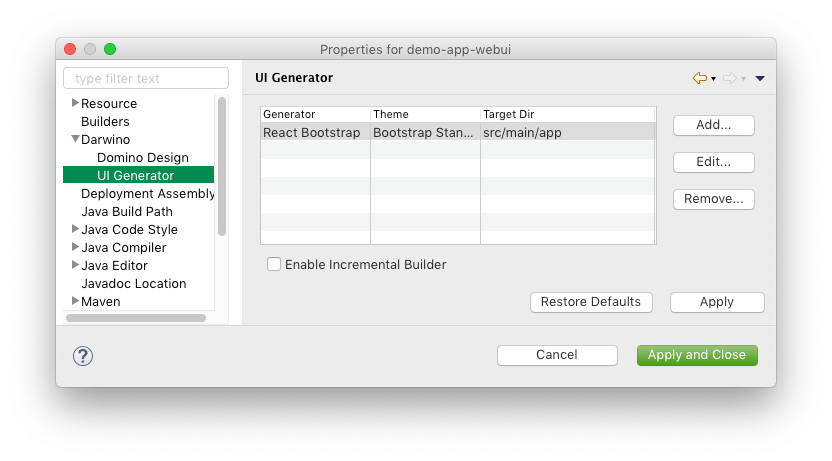
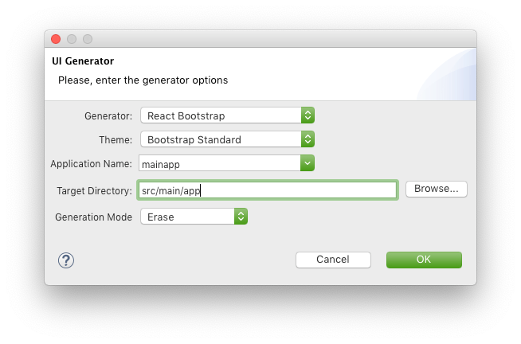
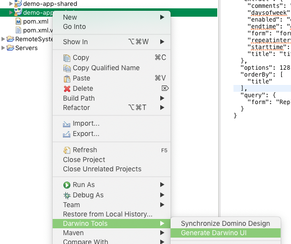

# Using the UI Generators

### Importing a Database Design

To begin with, right-click on the "-webui" Maven module and choose "Import":



In the resultant dialog, select "Darwino Design from Server" from within the "Darwino" category and click "Next >":



On the next page, choose your Domino server from the drop-down and use the "Choose" button to select a database from the server. After choosing one, the dialog will tell you if the design was successfully pulled:



Click "Finish" on the next page to import all design elements, or use the UI to tweak the import settings.

### Enabling the Generator

Right-click on the same project and choose "Properties", and then go to the "UI Generator" page within "Darwino":



Modify an existing entry or create a new one to match your desired generator and settings:



### Generate the UI

If you chose "Enable Incremental Builder" in the preferences, the UI elements should automatically be created. Otherwise, this can be done manually by right-clicking the project and choosing "Generate Darwino UI" from within the "Darwino Tools" submenu:



Once this happens, it will create the app's design elements based on the components used by the app starting point. When importing from an NSF, this will default to use the default Outline design element (named "Navigator" here), and this can be configured in the created "mainapp.dwo-app" file.

Depending on the type of UI generated, such as with React, it may be necessary to subsequently run a Maven install or individually execute NPM tasks to create a transpiled application. Ensure that the pom.xml for the "-webui" project contains a plugin definition to execute NPM, such as:

```xml
	<profiles>
		<profile>
			<id>build-webui</id>
			<activation>
            	<property>
                	<name>!m2e.version</name>
            	</property>
            </activation>
    		
			<build>
				<plugins>
					<plugin>
						<groupId>com.github.eirslett</groupId>
						<artifactId>frontend-maven-plugin</artifactId>
						<version>1.3</version>
						
						<configuration>
							<nodeVersion>v10.1.0</nodeVersion>
							<npmVersion>6.0.1</npmVersion>
							<installDirectory>target</installDirectory>
						</configuration>
						
						<executions>
							<execution>
								<id>install node and npm</id>
								<goals>
									<goal>install-node-and-npm</goal>
								</goals>
								<phase>generate-resources</phase>
							</execution>
							<execution>
								<id>npm install</id>
								<goals>
									<goal>npm</goal>
								</goals>
								<phase>generate-resources</phase>
							</execution>
							<execution>
								<id>webpack</id>
								<goals>
									<goal>webpack</goal>
								</goals>
								<phase>generate-resources</phase>
							</execution>
						</executions>
					</plugin>
				</plugins>
			</build>
		</profile>
	</profiles>
```

