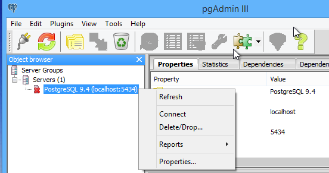
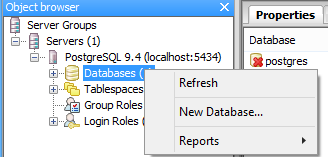
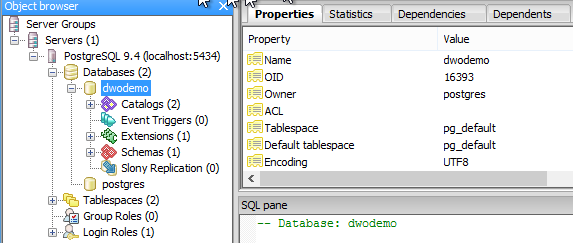

PostgreSQL is a free, open source database with great capability. It is particularly suited to Darwino because, since 9.4, it features a native JSON data type with query capabilities. Moreover, it comes with an integrated full text search engine.

Installing PostgreSQL
---------------------
If you just started with PostgreSQL, the we strongly advise you to run one of the predefined installers. See: [http://www.postgresql.org/download/](http://www.postgresql.org/download/ "Download PostgreSQL").
Please, choose the latest version, or at least version 9.4.

By default, the pre-packaged Darwino configuration files (see: TOMCAT installation) look for a PostgreSQL database on the local host using the user/password and port below: 
- Port: 5432 *(default)*
- Username: `postgres`
- Password: `postgres`

Configuring PostgreSQL for the Demo Application
-----------------------------------------------

The demo projects use a specific database called `dwodemo`, which should be created by either using the PostgreSQL command line tools, or the easiest UI admin 'pgAdmin III', installed by the PostgreSQL installer.

Here are the steps:

1. Launch pgAdmin III
2. Right click on the server and select 'Connect'. If asked, enter the password 'postgres'
	
3. Right click on the database and select 'New Database...'
	
4. Name it `dwodemo` and hit ok. All the other default settings 

Once done, you should see the database created after double clicking it in the list:

