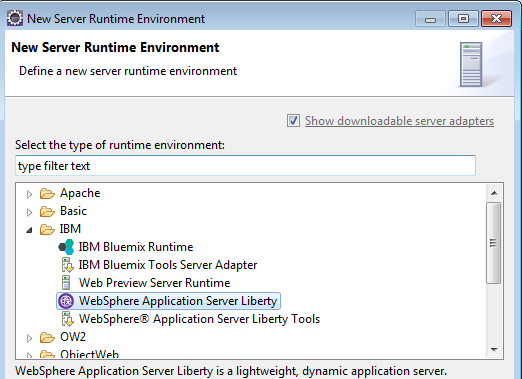
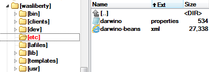
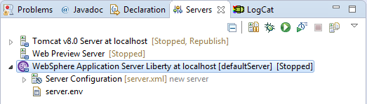

If you plan to use IBM Websphere Liberty as the development web application server, then you have to install it and configure the Eclipse accordingly.
The easiest is to drop the install site to the Eclipse toolbar, as explained here: [https://developer.ibm.com/wasdev/getstarted/](https://developer.ibm.com/wasdev/getstarted/ "https://developer.ibm.com/wasdev/getstarted/")

Configuring Eclipse with IBM Websphere Liberty
----------------------------------------------
Eclipse J2EE comes with a set of tools called WTP, which allows the configuration and use of application servers.
To configure WAS Liberty, you have to create a new 'Runtime Environment' from the Eclipse 'Window->Preferences...':

Download the [darwino-beans.xml](http://github.com/darwino/darwino-demo/wiki/darwino-beans.xml) and [darwino.properties](http://github.com/darwino/darwino-demo/wiki/darwino.properties) files to the Webphere Liberty install directory, under /etc (if the optional directory does not exist, just create it).

Now you have your server ready for the Darwino applications
