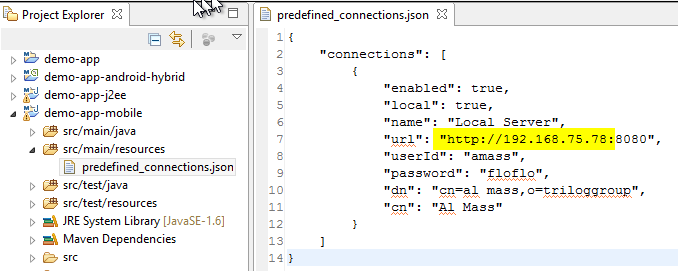
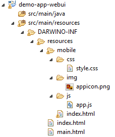

Although Darwino does not require the use of any IDE to work, the Darwino studio is the fastest way to get started with a new project.

Using the Darwino Application Wizard
------------------------------------

From the Eclipse main menu. select File...New...Project... and the search for Darwino:

Select 'New Darwino Application' hit Next.

For your first project, you can live the default values as is

Note: the first generation might take several minutes, as Eclipse is downloading all the necessary dependencies from the maven repositories. Subsequent runs of the wizard will be a lot faster :-)

This will create a Darwino Application that can run on a J2EE server, an Android mobile device and an iOS mobile device. To support all these platforms while sharing code, the wizard generated several projects in the Eclipse workspace:

Running the Web Application
---------------------------

If you're using a TOMCAT server, then you should add it in Eclipse from the 'Servers' view. Right click on the server, select 'Add and Remove...'. Select the new application, add it to the list of configured applications and hit 'Finish'.

Then, right click on the server, select 'Publish'. Finally right click another time on the server and hit 'Start'.

You should be able to hit the application from your browser by using a URL like: [http://localhost:8080/demoapp/main.html](http://localhost:8080/demoapp/main.html "Application URL")

Running the Mobile Applications
-------------------------------

Before running the mobile applications, you have to configure the server URL that the applications are using. This is not required, but heavily recommended to avoid every single user to have to configure the mobile application.
To do this, open the predefined_connections.json file and ensure that the server address is available from the device or emulator running the application:

Then run the app by right clicking the application and select 'Run As... Android Application' or 'Run As...iOS xxx' depending on your platform.

Extending the Generated Application
-----------------------------------

There are different places where the application can be extended

- Developing the UI
	A simple AngularJS based UI is located in the webui project:
	
- Adding business logic
	Business logic can be added to the shared project
	

And of course, everything can be customized!
