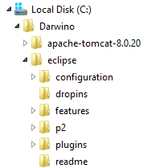
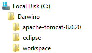
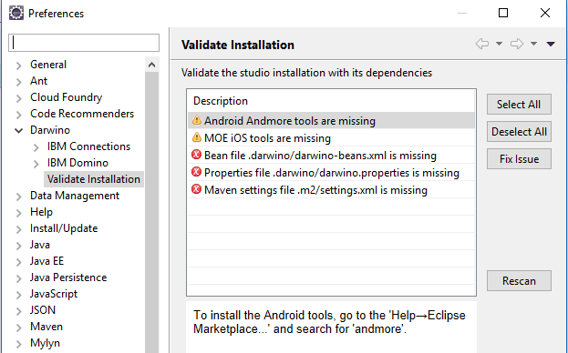
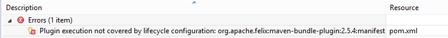

Installing the Eclipse IDE
--------------------------

Although the use of an IDE, and in particular Eclipse, is not a requirement, it certainly eases the development of Darwino applications. In particular, it also helps validate that all the requirements are met (installed software, configuration files...)

In order to configure web servers and get the best web development experience,
please download and install the latest version of '**Eclipse IDE for Java EE
Developers**‘ (NOT Eclipse IDE for Java Developers).
<http://www.eclipse.org/downloads/>

Darwino run best with the latest Eclipse version, currently Neon-1. Although it has been
tested with earlier versions like Mars-1, the maven integration definitively works best
with Neon.

Installing Eclipse is achieved by unzipping the archive in its target directory.
The following directory structure shows eclipse unzipped into the c:\\Darwino
directory:

Launching Eclipse for the first time
------------------------------------

When Eclipse is launched for the first time, it prompts for a workspace
directory.  The default value is fine, but well, you could also make this
directory a peer of the eclipse one, to get the whole environment contained
within `c:\Darwino`:

Installing the Darwino Studio add-on
------------------------------------

The first module to install is the Darwino Studio. Bellow are the instructions:

1.  Select Help \> Install New Software.

2.  In the "Work With:" field, enter the following URL, depending on the edition you selected:
	- Enterprise Edition: <https://eclipse.darwino.com/darwino/studio/enterprise/>
	- Community edition: <https://eclipse.darwino.com/darwino/studio/community/>

    Note that you can also install the nightly builds by using the URLs bellow. The nightly builds
    provide access to the latest version, under development
	- Enterprise Edition: <https://eclipse.darwino.com/darwino/studio/enterprise-nightly/>
	- Community edition: <https://eclipse.darwino.com/darwino/studio/community-nightly/>

3.  When prompted, enter your Darwino user and password, as provided during the registration process.

4.  In the Available Software dialog, select the Darwino Studio checkbox.

5.  In the next window, you'll see a list of the tools to be downloaded. Click
    Next.

6.  Read and accept the license agreements, then click Finish.

7.  If you get a security warning saying that the authenticity or validity of
    the software can't be established, click OK.

8.  When the installation completes, restart Eclipse.

Validating the configuration
----------------------------
The Darwino studio, once installed, features an installation validation module available under `Window->Preferences / Darwino`:

This module checks your environment and gives you guidance on the next actions:
- Having Maven settings.xml properly configured
- Having the Darwino configuration files at the right place
- Making sure that the Eclipse dependencies are installed
- ...

Manually Configuring Eclipse
----------------------------

The configuration validator exposed above should give you all the necessary information but some details are exposed bellow.

Darwino requires some extra plug-ins bellow to be installed on top of the
version of Eclipse. These plug-ins can generally be installed from the Eclipse
Marketplace or by selecting `Help->Install New Software...`, then use the
provided update site URL

-   If Android is a desired target platform:
    -   Andmore (successor to Google's ADT), Select `Help->Eclipse->Marketplace...` and search for `andmore`. It will be called something like "Andmore: Development Tools for Android"
	-   Note: during the process for installing m2e adapters (as with Tycho below), the m2e adapter for Android may prompt you to install the earlier Android Development Toolkit. If so, and you already have Andmore installed, deselect those plugins during the m2e setup.

-   If iOS is a desired target platform:
    -   Multi-OS Engine. The current update site is [http://dl.bintray.com/multi-os-engine/eclipse](http://dl.bintray.com/multi-os-engine/eclipse)

-   If IBM Domino is a desired target platform
    -   The Darwino project wizard as well as the sample applications use Tycho to target OSGi platforms (Eclipse, IBM Domino...). As a result, it requires the Tycho m2e connector to be installed. The easiest way to get it installed is to wait from Eclipse to display a build problem (see bellow), right click on the issue and choose quick fix. Eclipse will automatically propose to download and install the connector.
    

Eclipse Add-ons Information
---------------------------

-   Darwino Studio

    -   Update site URL:
        <https://eclipse.darwino.com/darwino/studio/enterprise/>
        <https://eclipse.darwino.com/darwino/studio/community/>
        <https://eclipse.darwino.com/darwino/studio/enterprise-nightly/>
        <https://eclipse.darwino.com/darwino/studio/community-nightly/>

-   Andmore (Android Tools)

    -   Install from the Eclipse Marketplace

-   Multi-OS Engine

    -   Instructions: <https://multi-os-engine.org/start/>

    -   Update site URL: <http://dl.bintray.com/multi-os-engine/eclipse>
