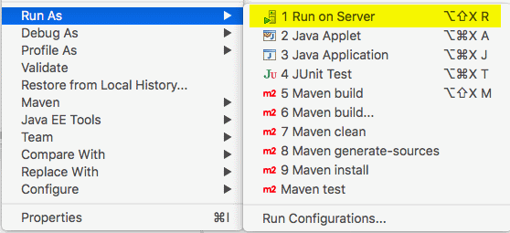
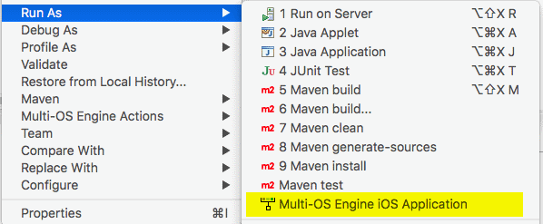

The Domino Discussion applications are an example of replicating with a standard Domino NSF-based discussion database.

J2EE Application
-----------------

The J2EE application is named `dwo-demo-dominodisc-j2ee`. To run it using a configured Tomcat server inside Eclipse, right-click on the project and choose Run As &rarr; Run On Server:

This will launch the app in Tomcat and open up the default landing page for the application.

This application can serve as a central server for replication with the mobile demo apps.

To configure its connection to a Domino server running the Darwino sync service, which is required for proper usage, modify the `src/main/webapp/WEB-INF/web.xml` file in the `dwo-demo-dominodisc-j2ee` project.

It connects to PostgreSQL for its local data storage. By default, it uses the port and credentials specified on the [[Preparing the Development Environment]] page. If needed, this can be modified by changing either the `src/main/resources/darwino_default.properties` file in the `dwo-demo-commons` project (which affects the other demos as well) or by creating a copy of this file named `src/main/resources/darwino.properties` in the `dwo-demo-dominodisc-j2ee` project itself.

Android Application
-------------------

The Android application is `dwo-demo-dominodisc-android-hybrid`. To run this app, right-click the project and choose Run As &rarr; Android Application:

iOS Application
---------------

If you are running on a Mac, you can run the iOS application, which is `dwo-demo-dominodisc-moe-hybrid`. To do so, right-click on the project and choose one of the Run As &rarr; iOS Simulator App options:

