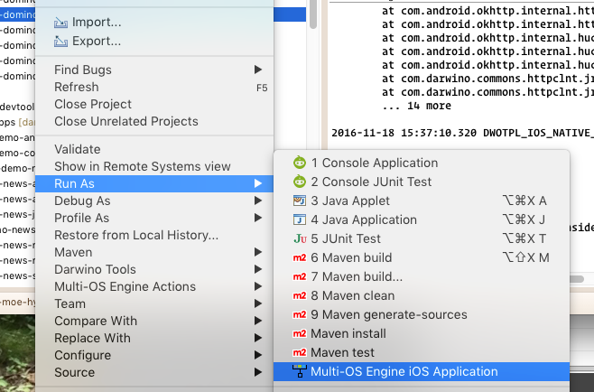
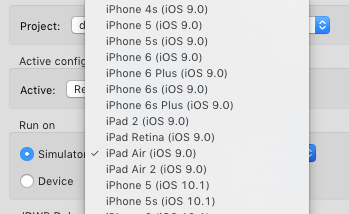

Building the iOS demo application requires a Mac with a valid iOS developer profile registered via Xcode's Accounts preference panel. To see if your computer has any active profiles, run:

	security find-identity -v -p codesigning

That should list any available signing profiles, and valid ones will contain "iPhone Developer" or "iOS Development".

Running in the Simulator
------------------------

To run iOS applications in the simulator, right-click the iOS project in Eclipse and choose Run As &rarr; Multi-OS Engine iOS Application:

To change the device or OS version used in the simulator, choose "Run Configurations" and select a different target device from the list:

Running on an iOS Device
------------------------

Running an application on a physical iOS device can be done by adjusting the Run Configuration as above, but instead choosing a physical device from the list.