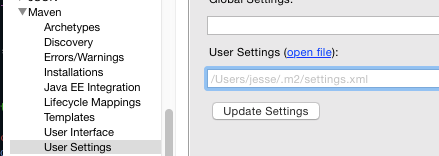

Darwino projects require Maven to be properly configured to point to the Darwino repository. This is best done by modifying Maven's settings file, which is a file called `settings.xml` located in the `.m2` directory in your home folder.

If you're using Eclipse and this file already exists, you can open it for editing by going to the Maven &rarr; User Settings pane in Eclipse's Preferences and clicking "Open File":

If the file does not yet exist, this link will be absent. In that case, create a new file in a text editor and, when saving, browse to your home directory (e.g. C:\Users\yourname on Windows), create a folder named ".m2" (with the leading dot), and save the file as "settings.xml" within it.

Depending on your system, it may be difficult to create a new folder named ".m2". If that is the case, it may be necessary to open a Command Prompt or Terminal window, which should default to your home directory, and type `mkdir .m2`.

Setting up the Repository
-------------------------

The important information to add to your Maven settings is the location of the Darwino repository, which contains the core Darwino components as well as needed third-party dependencies.

Here is an example complete settings.xml containing the remote repository using the generic repo accessor username. If your settings.xml file didn't exist previously, you can use this as the file's contents.

	<?xml version="1.0"?>
	<settings xmlns="http://maven.apache.org/SETTINGS/1.0.0" xmlns:xsi="http://www.w3.org/2001/XMLSchema-instance" xsi:schemaLocation="http://maven.apache.org/SETTINGS/1.0.0 http://maven.apache.org/xsd/settings-1.0.0.xsd">
		<profiles>
			<profile>
				<id>darwino-repository-profile</id>
				<repositories>
					<repository>
						<id>darwino-repository</id>
						<name>Darwino Platform</name>
						<url>http://builds.darwino.com/artifactory/repo/</url>
					</repository>
				</repositories>
			</profile>
		</profiles>
		<activeProfiles>
			<activeProfile>darwino-repository-profile</activeProfile>
		</activeProfiles>
		<servers>
			<server>
			    <id>darwino-repository</id>
			    <username>repo</username>
			    <password>AP7d25JuFEitQAXAfkLb45Gn8xr</password>
			</server>
		</servers>
	</settings>

To merge this into an existing settings.xml, the pertinent components are the `<profile>...</profile>` block, including the named profile in the `activeProfiles`, and specifying the credentials used when accessing the repository.