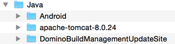

Basic Maven Settings
--------------------

Darwino projects require Maven to be properly configured to point to the Darwino repository. This is best done by modifying Maven's settings file, which is a file called `settings.xml` located in the `.m2` directory in your home folder.

If you're using Eclipse and this file already exists, you can open it for editing by going to the Maven &rarr; User Settings pane in Eclipse's Preferences and clicking "Open File":

If the file does not yet exist, this link will be absent. In that case, create a new file in a text editor and, when saving, browse to your home directory (e.g. `C:\Users\yourname` on Windows, `~/` on a mac), create a folder named ".m2" (with the leading dot), and save the file as "settings.xml":

 If it is a new file, use the following content or merge it with the existing file:

	<?xml version="1.0"?>
	<settings xmlns="http://maven.apache.org/SETTINGS/1.0.0" xmlns:xsi="http://www.w3.org/2001/XMLSchema-instance" xsi:schemaLocation="http://maven.apache.org/SETTINGS/1.0.0 http://maven.apache.org/xsd/settings-1.0.0.xsd">
		<profiles>
			<profile>
				<id>darwino-repository-profile</id>
				<repositories>
					<repository>
						<id>darwino-repository</id>
						<name>Darwino Platform</name>
						<url>https://maven.darwino.com/darwino-enterprise-edition</url>
					</repository>
				</repositories>
			</profile>
		</profiles>
		<activeProfiles>
			<activeProfile>darwino-repository-profile</activeProfile>
		</activeProfiles>
		<servers>
			<server>
			    <id>darwino-repository</id>
			    <username>]username]</username>
			    <password>[password]</password>
			</server>
		</servers>
	</settings>

Of course, you have to set your own user and password and, depending on the edition you are
willing to use, set the repository URL to:
- Enterprise Edition
	<https://maven.darwino.com/darwino-enterprise-edition>
- Community Edition
	<https://maven.darwino.com/darwino-community-edition>
These maven repositories contain both the production builds and the nightly ones (aka xxxx-SNAPSHOTS)

To validate that your maven settings are correct, display the Maven Repositories view in
eclipse (`Window->Show View->Other...`). Hit the refresh button to make the Darwino repository appear. Finally, right click on this repository and select `Rebuild Index`,. As a result, you should see the Darwino assets like in:

Installing the Android Libraries
--------------------------------

The Darwino sample projects, as well as the studio wizards, assume that these libraries are available.

The Android libraries are currently not available from the maven central repository, so each
developer has to install them in his local repository. Fortunately, there are some
available scripts and instructions provided [here](https://books.sonatype.com/mvnref-book/reference/android-dev-sect-config-build.html#android-dev-sect-repository-install).

Tip: there are two ways to install these libraries:
1.  Using maven and the command line, as documented in the Github repository. This requires maven to be properly installed. See: [https://maven.apache.org/install.html](https://maven.apache.org/install.html).
We suggest to only install the platforms that you need using `mvn install -P xxx`, where xxx is the desired platform release.
2.  Using the Eclipse built-in maven install. To do this, make sure that `ANDROID_HOME` is defined before you launch Eclipse. Then, follow the instruction above to download the installer. In Eclipse, import the main project (and only this one) in your workspace:

Finally, right click on the project, select "Run As...Maven Build..." and manually enter the install command with the desired platform:

Once done, you can remove this maven project from your workspace, unless you want to install more platforms going forward.

IBM Domino Specific Settings
----------------------------

If you will be working on Domino-related projects, it is necessary to download and install and reference the IBM Domino Update Site for Build Management from [openntf.org](https://www.openntf.org/main.nsf). It contains the OSGi plugins required by Domino.

The Update Site can be downloaded [here](http://www.openntf.org/main.nsf/project.xsp?r=project/IBM%20Domino%20Update%20Site%20for%20Build%20Management). Expand the download zip file and place the contents in the Java install directory.

In Eclipse Preferences, add the Update Site to the target platform. To do this, under 'Plug-in Development\Target Platform' select the Running Platform and choose 'Edit...'. In the resulting dialog, choose 'Add...', then 'Directory', then point to the Update Site directory and click 'Finish'. 

The important information to add to your Maven settings is the location of the Darwino repository, which contains the core Darwino components as well as needed third-party dependencies.

Here is an example of a complete settings.xml containing the remote repository using the generic repo accessor username. If your settings.xml file didn't exist previously, you can use this as the file's contents. If you will be working on Domino-related projects, change the file path specified in the notes-platform property to your Java directory. If you will NOT be working on Domino-related projects, you can delete the notes-platform property altogether.

	<?xml version="1.0"?>
	<settings xmlns="http://maven.apache.org/SETTINGS/1.0.0" xmlns:xsi="http://www.w3.org/2001/XMLSchema-instance" xsi:schemaLocation="http://maven.apache.org/SETTINGS/1.0.0 http://maven.apache.org/xsd/settings-1.0.0.xsd">
		<profiles>
			<profile>
				<id>darwino-repository-profile</id>
                <properties>
                	<notes-platform>
                    	file:///*path to Java installation*/DominoBuildManagementUpdateSite/UpdateSite
                	</notes-platform>
            	</properties>
				<repositories>
					<repository>
						<id>darwino-repository</id>
						<name>Darwino Platform</name>
						<url>https://maven.darwino.com/darwino-enterprise-edition</url>
					</repository>
				</repositories>
			</profile>
		</profiles>
		<activeProfiles>
			<activeProfile>darwino-repository-profile</activeProfile>
		</activeProfiles>
		<servers>
			<server>
			    <id>darwino-repository</id>
			    <username>]username]</username>
			    <password>[password]</password>
			</server>
		</servers>
	</settings>

To merge this into an existing settings.xml, the pertinent components are the `<profile>...</profile>` block, including the named profile in the `activeProfiles`, specifying the credentials used when accessing the repository, and adding the notes-platform property (if you will be working on Domino-related projects).