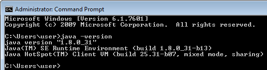
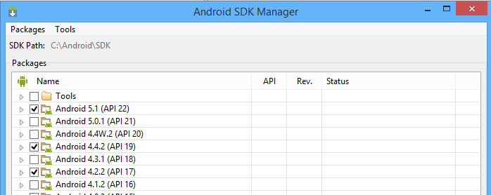

Darwino is a very flexible platform that supports IDE or command line based development. The platform itself is built using [Apache Maven](http://maven.apache.org/ "Apache Maven"). If Maven is also the recommended build tool for Darwino applications, other systems can also be used, including Gradle, Eclipse PDE...

Darwino currently supports the following target platforms:
- Web applications through a Java EE server
- Android applications
- Apple iOS applications
- OSGi environments, like Eclipse rich client or IBM Domino

Unless specified otherwise, all the installation instructions assume a Microsoft Windows environment, with the software being installed on `c:\Darwino`. The instructions can easily be transposed to another OS, like Apple OSX or Linux.

Notes: Based on Apple requirements, an Apple Mac computer running OS X is required for developing Apple iOS applications. Currently, only Android applications can be developed and tested using Microsoft Windows or Linux.

Darwino prerequisites
---------------------

A Java environment must be installed on your machine. The minimum version is Java 7, but it is advised to use the latest one (Java 8 as of today).

A web application server is required to run the web applications. Although any servlet container 2.5+ would work, these instructions show how to install/run the demo projects using Apache TOMCAT

A Postgres 9.4.x database server. Other databases may be used, but the demo applications are pre-configured to work with PostgreSQL. Note that a future version of Darwino might use a embedded database and thus this step won't be necessary.

Installing the Java JRE/JDK
---------------------------

If you plan to use Eclipse as the main development environment, then a Java JRE is sufficient. If you plan to use Maven from the command line, then you'll need a full JDK to be installed.

Both the Java JRE and SDK can be downloaded from the Oracle web site: [http://www.oracle.com/technetwork/java/javase/downloads/index.html](http://www.oracle.com/technetwork/java/javase/downloads/index.html). An IBM JDK will also work.
Once installed, make sure that the development environment variable JAVA_HOME is pointing to you Java environment. Make also sure that you JVM is available from the command line by emitting `java -version`.

Installing the Android application development tools
----------------------------------------------------

Developing for the Android platform requires the Android Software Development Kit to be installed. It is available from: [http://developer.android.com/sdk/index.html#Other](http://developer.android.com/sdk/index.html#Other "Android SDK"). The 'SDK Tools only' package is sufficient if you plan to use Eclipse or Maven from the command line.

Using the SDK manager [Android SDK manager](http://developer.android.com/tools/help/sdk-manager.html), select and install at least the entire "Android 4.2.2 (API 17)" & "Android 4.4.2 (API 19)" folders.

Additionally, set the path to the Android SDK root (e.g. `c:\Android\SDK`) in an environment variable named `ANDROID_HOME` as well as in the Maven `settings.xml` (see the documentation on installing Maven).

Note: using the stock Android emulator, it is likely that the applications will be too slow to provide a great developer experience. This is particularly true if you launch the emulator from a virtual machine. It is then better to run the demo applications on real hardware or in a faster emulator/virtual machine. See: [http://blog.riand.com/2014/08/running-android-apps-for-development.html](http://blog.riand.com/2014/08/running-android-apps-for-development.html)

Installing the iOS application development tools
------------------------------------------------

As stated earlier, developing for iOS requires an Apple Mac computer running OS X. To compile, run in a simulator or deploy the application, the Apple Xcode development environment is required. It is available freely from the Mac App Store ([https://itunes.apple.com/us/app/xcode/id497799835?mt=12](https://itunes.apple.com/us/app/xcode/id497799835?mt=12 "Xcode")).

Apache TOMCAT
-------------
See: [[Configuring TOMCAT]]

PostgreSQL
----------
See: [[Configuring PostgreSQL]]

Maven Configuration
-------------------

Maven should be configured to point to the Darwino repository. See the following instructions: [Setting Up Maven](Maven Settings).
