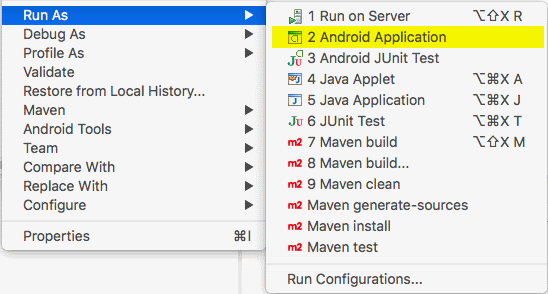

The Contacts sample is a simple project showing the capabilities of the Darwino platform:
- Sample view/form based application
- Runs as a web app as well as mobile hybrid on mobile devices
- Leverages the UI code generator for the UI

Installing the Contacts application in Eclipse
----------------------------------------------

The Contacts application is provided by the [darwino-demo](https://github.com/darwino/darwino-demo) Github repository as a set of maven enabled projects.
To import them in Eclipse once the Git repository has been cloned, select `Import...->Existing Maven Projects` and choose `darwino-demo/contacts`.

The result should be a set of projects in your workspace:

Note: if this is the first project you import, you might be prompted by Eclipse to install some M2E connectors. If this happens, just install the connectors and reboot Eclipse.

Running the Web Application
---------------------------

There are two ways to run the contact application:
- By starting TOMCAT using the Maven plugin. This is the simplest solution to start with.
- By installing the application within a full TOMCAT

### Running the application through Maven ###
You first have to build the project using Maven. For this, right click on the `contacts` root project and select `Maven install`:

Once done, right click on the `contacts-j2ee` project and select `Maven build...`. In the goal field, enter `tomcat7:run`:

If this is the first time TOMCAT is run this way, then all the dependencies will be downloaded by Maven, which will take a few minutes.

The URL to the application is: [http://localhost:8080/contacts/mobile/index.html](http://localhost:8080/contacts/mobile/index.html)

### Running the application using Eclipse WTP ###

This will launch the app in Tomcat and open up the default landing page for the application. 

Android Applications
--------------------

The Android application is `contacts-android-hybrid`. To run it, right-click the project and choose Run As &rarr; Android Application:

iOS Applications
----------------

If you are running on a Mac, you can run the iOS application, which is `contacts-moe-native`. To do so, right-click on the project and choose one of the Run As &rarr; iOS Simulator App options:

