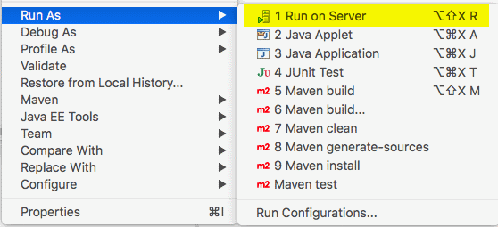
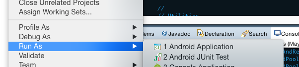
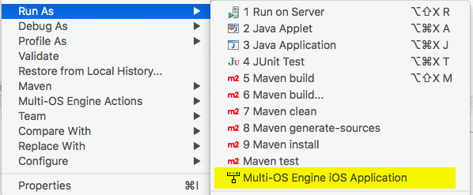
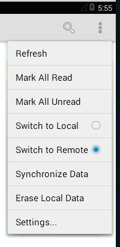

The News applications are an example of a syncing news-reader app with randomly-generated article content. It contains a J2EE application with two UI examples and which can act as a remote server for its mobile applications. It also includes pairs of examples for both Android and iOS: native UIs and hybrid (HTML-based) UIs.

J2EE Application
-----------------

The J2EE application is named `dwo-demo-news-j2ee`. To run it using a configured Tomcat server inside Eclipse, right-click on the project and choose Run As &rarr; Run On Server:

This will launch the app in Tomcat and open up the default landing page for the application. In addition to the default JSF-based UI, there is also an Angular-based UI, which is shared with the hybrid mobile applications.

This application can serve as a central server for replication with the mobile demo apps.

It connects to PostgreSQL for its data storage. By default, it uses the port and credentials specified on the [[Preparting the Development Environment]] page. If needed, this can be modified by changing either the `src/main/resources/darwino_default.properties` file in the `dwo-demo-commons` project (which affects the other demos as well) or by creating a copy of this file named `src/main/resources/darwino.properties` in the `dwo-demo-news-j2ee` project itself.

Android Applications
--------------------

The two Android applications are `dwo-demo-news-android-hybrid` and `dwo-demo-news-android-native`. To run either of these apps, right-click the project and choose Run As &rarr; Android Application:

iOS Applications
----------------

If you are running on a Mac, you can run the iOS applications, which are `dwo-demo-news-robovm-native` and `dwo-demo-news-robovm-hybrid`. To do so, right-click on the project and choose one of the Run Ad &rarr; iOS Simulator App options:

Connecting to the J2EE App from Mobile
--------------------------------------

To connect to a running instance of the J2EE application from either the Android or iOS applications, modify the connection settings in the `src/main/resources/predefined_connections_default.json` file in the `dwo-demo-commons-mobile` project, replacing `{0}` with the base URL of your Tomcat server in the first settings block. For example, where the Tomcat server is "10.0.1.8" and running on port 8081:

    {
        "enabled": true,
        "local": false,
        "name": "Local Server - http://10.0.1.8:8081",
        "url": "http://10.0.1.8:8081",
        "userId": "amass",
        "password": "floflo",
        "dn": "cn=al mass,o=triloggroup",
        "cn": "Al Mass"
    }

These settings can also be modified from within the mobile applications when running by going to the settings for the app, which is available by tapping "Settings" in the bottom-right corner of the iOS native app and in the top-right drop-down menu otherwise:

