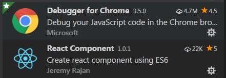

# Introduction
If Darwino is agnostic in term of UI, it provides some components to facilitate the creation of form based applications. These components can be reused within existing applications or used to create brand new ones. Moreover, because they are built on top of existing, standard technologies, they can be extended and/or augmented with other third party libraries.

## Technology choices
As UI technologies are constantly evolving, Darwino will provide, in the longer term, support for several UI technologies. For web Technologies, we make a distinction between the core JS library and the CSS framework being used.
As of today, here is the list of supported technologies:
1. ReactJS + Bootstrap.

## Installation - prerequisites
Darwino client side libraries require the latest node.js and npm to be installed. You can find more information on how to download and install this software here:
https://nodejs.org/en/

## Installing the tooling
If Eclipse can be used to develop modern web application, it is not currently part of the core platform but delivered through third party plug-ins. To provide the best developer experience, we use other dedicated tooling to edit the JavaScript code. In this tutorial, we use Microsoft Visual Studio Code. It can be downloaded from here: https://code.visualstudio.com/
As visual studio works well with the Chrome browser, make sure that the latest version of Google Chrome is properly installed.
Finally, install the following plugins inside MS Visual Studio:
1. React Components
2. Debugger for Chrome

## Setting up the repository
The Darwino JavaScript assets are distributed through a private npm server serving all the packages scoped by @darwino.

To be able to consume them, you should instruct you local npm to use that server for @darwino. This is done by running the following command from the command line:

    npm adduser --registry https://npm.darwino.com --scope @darwino

It will ask you for your darwino user/password and your email. Once done, you'll be able to consume all the darwino packages as described at: https://npm.darwino.com

## Consuming the code
As of today, the JavaScript code is designed to be directly integrated as ES6 modules within the final application, and then bundled using a tool like [Webpack](https://webpack.js.org/). For performance and flexibility reasons, there is no ready to use single JavaScript file.
