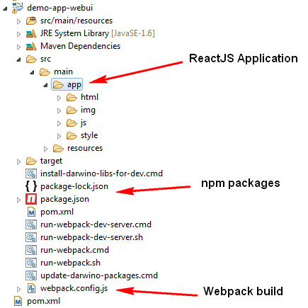
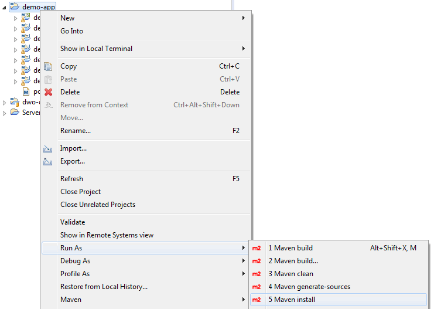
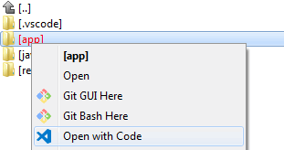
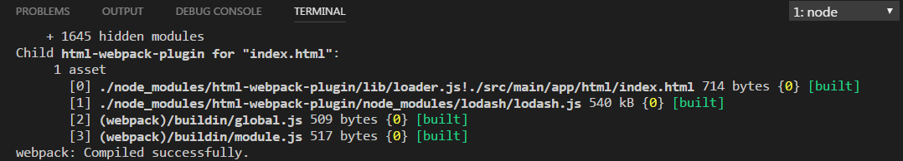

# Setting up the development environment

## Project structure
When you create the project from the Darwino Studio and select react-bootstrap as the UI framework, you'll have the following folder structure:

All the files making the UI are located in the app sub directory. Thus, you can open this directory with MS Visual Studio Code, and start working on the UI.

## Building and Running the code
The project is designed with continuous build in mind using maven as the main build tool. To build the whole project, including both the Java and the JavaScript code, just execute a 'maven install' on the parent project. Note that the very first build requires an internet connection and can take several minutes. Tt downloads a local copy of node.js, as well as all the project npm dependencies.

Assuming that Darwino is properly installed on the dev machine (darwino-beans.xml...), then the application can be added to a server and accessed using the following URL
[http://localhost:8080/demoapp](http://localhost:8080/demoapp)
The build process generates a WAR file that can be deployed to any web application server, like any other Darwino application.

## Running and debugging the code

### Setting up MS Visual Studio
Darwino is taking advantage of the Webpack development server and MS Visual Studio to run the client side application in debug mode.
Here is how to enable that, assuming that MS Visual Studio is opened on the 'app' folder:
1. Open MS Visual Studio on the application 'app' folder

2. In MS Visual Studio, display the 'Integrated terminal view'
3. Enter the following command: `npm run dev`. This starts the Webpack development server. To not collide with the Java TOMCAT server, Darwino configured it to use port `8008`.
Once launched, the terminal should display something like:

4. The application can now be accessed using the following URL:
http://localhost:8008

The TOMCAT server should be running, as it still serves the data on port 8080. But this has a fgew challenges, as the 2 servers work are from different domains and do not share authentication:
1. CORS should be enabled in web.xml
Darwino provides a CORS filter that is enabled by default when the application is generated by the new project wizard. This filter can be removed, or customized, when going to production.
2. If the application requires authentication, you should open another window in Chrome and hit the TOMCAT server to get authenticated.

### Debugging the application using Google Chrome
To debug the application, simply go to `Debug->Start Debug` in the MS Visual Studio menus. If there is no Chrome configuration, then just create one. Chrome should be launched and you should be able to debug your client code.
