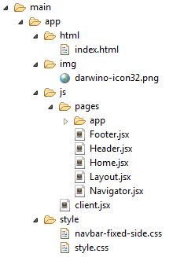

# Building a React/Bootstrap application

The Darwino wizard generated a application skeleton with the following files:

Let's look at the different files:

- index.html
This is the main application page to launch. It contains the meta-data of the page, and a `
` that will host the whole ReactJS application
- client.jsx
This is the main ReactJS page. It loads the JavaScript code, initializes all the libraries and instantiates the main layout component
- Layout.jsx
This lays out the whole page using the bootstrap library. It creates a header, a footer and a body. It takes advantage of the responsive capability of the bootstrap library.
- Navigator.jsx
- Header.jsx
This is a header, displaying by default the company brand and the current user
- Footer.jsx
This is the footer, displaying by default the company brand and the current user
- Home.jsx
This is the home page, as the first choice in the left Navigator
