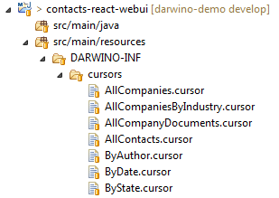

# Adding a view

A view, in Darwino, is actually a query to the database. The developer will have to do a few tasks:
1. Define the database query
2. Create the UI for the view
3. Eventually, add the view to the navigator

## Defining the query
The query can be defined dynamically in the UI control, or created as part of the application and then referenced by name. We're going to use the later, as it is a good idea to pre-define these queries.
By default, such a query is a file of type `.cursor` located in the `DARWINO-INF/cursors` resources of your project. In the demo application, the queries are in the contacts-react-webui project:

Each query is a JSON file containing the query containing the query definition. The name of the file is also the name used to reference the query when calling the REST service.
Here is some sample content, from `AllCompaniesByIndustry.cursor`:

    {
      "store": "companies",
      "extract": {
        "Industry": "industry",
        "State": {$USState: "$state"},
        "Name": "name",
        "form": "form"
      },
      "query": "{form: 'Company'}",
      "options": "DATA_MODDATES",
      "orderBy": "industry,state"
    }

## Creating the view UI
The UI can be done multiple ways, up to manually rendering. But Darwino provides a convenient UI Data Grid component that can be used to display a view, if this is the desired UI. This component provides many advanced capabilities, like dynamic sorting, categorization, collapsible children documents, totalization rows, responsive design...
A typical view page is a JavaScript file containing 2 components: the grid component with eventually some customization, and the page component. Isolating the grid in it own component allows its reuse in other parts of the UI (popup showing the view, embedded view...).

The AllCompanyByIndustry.jsx defines such a view. The most important parameters are the grid ones, defined there as `defaultProps`.

## Adding the view to the navigator
There are 2 things to do:
1. Define the route path to reach the view
This defines the URL used by the router to access the view. It associates a path with the page component to display.
        <Route exact path="/app/allcompaniesbyindustry" component={AppAllCompaniesByIndustry}></Route>
2. Add the view to the UI navigator
This is done in the Navigator.jsx with a `NavLink` component.
        <NavLink to="/app/allcompaniesbyindustry">By Industry/State</NavLink>

