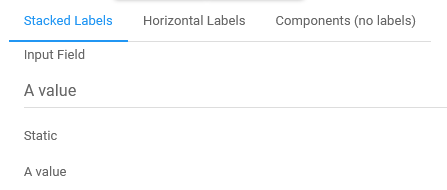
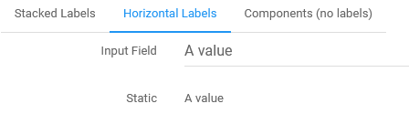
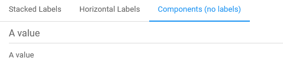

# Field Label Layout

The `renderXXXX` components have a label that can be on top of the component or on the left side. This is driven by the attribute `horizontal`.

**Stacked**

See: `extras/FormLayoutStacked.jsx`

**Horizontal**

See: `extras/FormLayoutHorizontal.jsx`

**Plain Components (no label)**
To completely avoid displaying labels, use the `FieldXXXX` components instead. They behave the same than the `renderXXXX` without being decorated with a label. The error messages are not displayed as well with `FieldXXXX`.

See: `extras/FormLayoutComponents.jsx`
