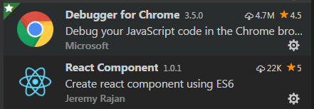

# Darwino UI Library

If Darwino is agnostic in term of UI, it provides some components to facilitate the creation of form based applications. These components can be reused within existing applications or used to create brand new ones. Moreover, because they are built on top of existing, standard technologies, they can be extended and/or augmented with other third party libraries.

## Technology choices

As UI technologies are constantly evolving, Darwino will provide, in the longer term, support for several UI technologies. For web Technologies, we make a distinction between the core JS library and the CSS framework being used.  
As of today, here is the list of supported technologies:  

1. ReactJS + Bootstrap.

## Installation - prerequisites

Darwino client side libraries require the latest node.js and npm to be installed. You can find more information on how to download and install this software here:  
[https://nodejs.org/en/](https://nodejs.org/en/)

## Installing the tooling

If Eclipse can be used to develop modern web applications, it is not currently the technology being the most enjoyed by client side developers. To provide the best developer experience, we use other dedicated tooling to edit the JavaScript code. In this tutorial, we use Microsoft Visual Studio Code. It can be downloaded from here:
[https://code.visualstudio.com/](https://code.visualstudio.com/)  

As visual studio works well with the Chrome browser, make sure that the latest version of Google Chrome is properly installed. Chrome also features many other plug-ins that you can find useful, like ReactJS one.

To complete the MS Visual Studio installation, please install the following plugins:  

1. React Components  
2. Debugger for Chrome

## Setting up the repository

The Darwino JavaScript assets are distributed through a private npm server serving all the packages scoped by @darwino (see: [https://docs.npmjs.com/private-modules/intro](https://docs.npmjs.com/private-modules/intro)) and hosted in the main NPM registry.

## Consuming the code

As of today, the JavaScript code is designed to be directly integrated as ES6 modules within the final application, and then bundled using a tool like [Webpack](https://webpack.js.org/). For performance and flexibility reasons, it is required to 'build' the JavaScript code.
