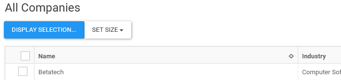

# Actions and action bars

The `ViewPage`, as well as the `DocumentForm` class, can gather actions and eventually display them in an action bar. These actions are contributed through a `contributeActionBar()` function, implemented within a form, subform, or a viewgrid object.

## Displaying the action bar

The pages don't automatically create the actionbar as it cannot preclude the desired UI and its location. As such, the actionbar should be explicitly created by the page, in its render method:

    render() {
      return (
        

          <form onSubmit={handleSubmit(this.handleUpdateDocument)}>
            {this.createActionBar()}

Note: the Notes/Domino specific base classes for forms and views create this action bar, as it mimics Notes/Domino UI. See the Notes/Domino specific chapter.

See: `Contact.jsx`

## Executing an action

The pattern for an action is to add a button that bind `onClick` to a page method containing the code to execute. The function `onClick` should either be `bind()` to `this`, or use a lambda like bellow:

    contributeActionBar() {
      return (
        

          <Button onClick={() => {this.export('csv')}}>Export</Button>
        

      );
    }

The code in the action can access the field values using the form/subform `getFieldValue()`. In subforms, the parent form object is available using `getForm()`.

Similarly, an action can set the document field using `setFieldValue()`, which is behind the scene calling the proper redux functions.

**DO NOT** change the fields value without going through these methods. Else, the redux store will not be udpadet and the changes will be lost. The UI components won't be updated.

See: `CCAddress.jsx`