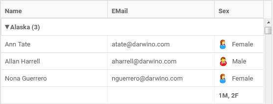
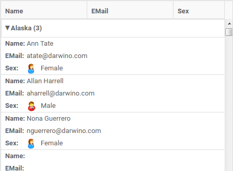

# View grid customization

The Darwino view grid is based is based on the react-data-grid component, with a few 
enhancements.

## Making the grid reponsive
The view grid can be made responsive to adapt to different screen size by setting the 
`responsive` property to `true`.

Note: due to some `react-data-grid` limitations, this is still a preview function.

## Custom column rendering
The content of a column is generally the row content of a JSON field, converted to a string. This content can be formatted using a grid column property:

    {name: "Date", key: "Date", resizable:true, formatter: DateFormatter, width:150},

This formatter is a function that returns a piece of markup to be displayed in the grid cell. In the example bellow, it uses `FormattedDate` from `react-intl` to format the date:

    export const DateFormatter = function(props) {
      const date = props.value;
      return (
        

          <FormattedDate value={date}/>, <FormattedTime value={date}/>
        

      )
    }

A formatter can also return more complex markup, including images. 
        
See: `ByDate.jsx` for the date formatting
See: `ByState.jsx` for displaying an image in a cell

## Custom row rendering
The whole row rendering can also be customized by assigned a `CursorGridRowRenderer` class to the ViewGrid `rowRenderer` property:

    class CustomRenderer extends CursorGridRowRenderer {   
    }    
    
    rowRenderer: CustomRenderer,

See: `ByState.jsx`    

## Customizing a category
A category entry can be customized by providing a formatter to a groupBy entry in the ViewGrid properties:

    groupBy: [{column: "State", formatter: formatGroup}],

See: `ByState.jsx` where each category displays the number of documents it contains

## Adding extra rows
That migh seems strange at the begining, but it is useful to display totalization and other extra data calculated out of the data in the grid.
Everytime the ViewGrid reads data from the server, it gives to the developer an opportunity to process the entries and, eventually, insert or remove rows (filter)
This is done using the `processEntries` property.

See: `ByState.jsx` for the totalization of the male and female entries
